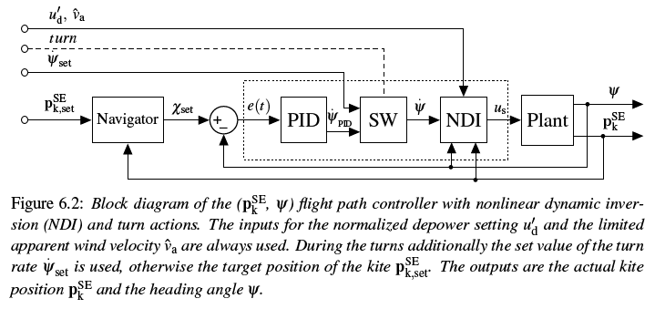
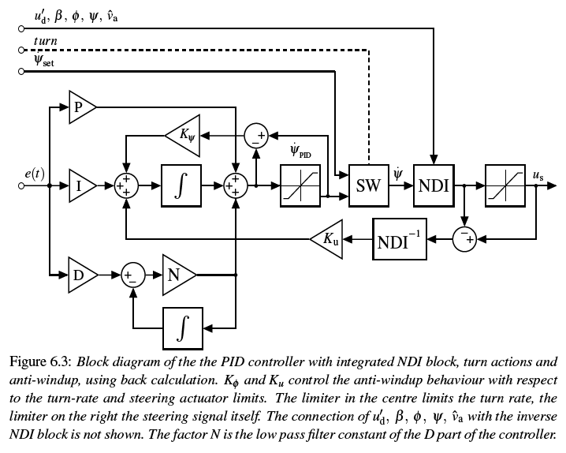
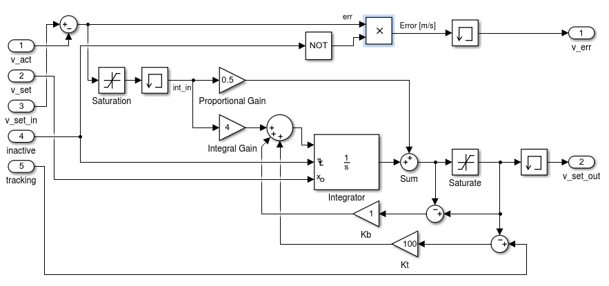

# KiteControllers
[](https://github.com/aenarete/KiteControllers.jl/actions/workflows/CI.yml?query=branch%3Amain)
[](https://codecov.io/gh/aenarete/KiteControllers.jl)
[](https://zenodo.org/doi/10.5281/zenodo.13255245)
[](https://github.com/JuliaTesting/Aqua.jl)

Discrete controllers for kite power systems.

This package is part of Julia Kite Power Tools, which consists of the following packages:
<p align="center"></p>

## Installation
<details>
  <summary>Installation of Julia</summary>

If you do not have Julia installed yet, please read [Installation](https://github.com/aenarete/KiteSimulators.jl/blob/main/docs/Installation.md).

</details>

<details>
  <summary>Installation as package</summary>

### Installation of KiteControllers as package

It is suggested to use a local Julia environment. You can create it with:
```bash
mkdir myproject
cd myproject
julia --project="."
```
and then, on the Julia prompt enter:
```julia
using Pkg
pkg"add KiteControllers#main"
```
You can run the tests with:
```julia
using Pkg
pkg"test KiteControllers"
```
To add the examples and install the packages needed by the examples, run:
```julia
using KiteControllers
KiteControllers.install_examples()
```
</details>

<details>
  <summary>Installation using git</summary>

### Installation of KiteControllers using git

In most cases -- if you want to modify, tune and understand kite controllers -- it is better
to check out this project from git. You can do this with:
```bash
git clone https://github.com/aenarete/KiteControllers.jl.git
cd KiteControllers.jl
git checkout v0.2.15
```
For the checkout command, use the tag of the latest version.
It is suggested to create a system image:
```bash
cd bin
./create_sys_image --update
cd ..
```
On Linux you can install the `autopilot` GUI app as normal application with the command `bin/install`.

</details>

### Running the first example

You can now start Julia with `./bin/run_julia` and execute the autopilot or any other of the examples with:
```julia
include("examples/autopilot.jl")
```

You get a menu with all the examples by typing:
```julia
include("examples/menu.jl")
```

## This package provides
### Utility functions
```
saturate(value, min_, max_)
```
Calculate a saturated value, that stays within the given limits.
```
wrap2pi(angle)
```
Convert an angle, given in radians in an infinite range to the range from -pi to pi

### Generic control components
This package contains some generic control components that are documented [here](./docs/components.md).

### Types that are not generic
```julia
CalcVSetIn              # component that calculates the set speed using soft switching
SpeedController         # controller for normal operation
LowerForceController    # controller when force near lower limit
UpperForceController    # controller when force near upper limit
WinchController         # winch controller, combining the three controllers above
WCSettings              # settings of the winch controller
WinchModel              # simplified model for unit testing

FlightPathController    # represents the flight path controller
FPCSettings             # settings of the flight path controller
FlightPathCalculator    # calculate the planned flight path
FlightPathPlanner       # execute the planned flight path
FPPSettings             # settings of the flight path planner
KiteModel               # simplified model for unit testing

SystemStateControl      # high level state machine, receives commands from the GUI
                        # and calls FlightPathPlanner and WinchController
```

## Flight path controller
FlightPathController as specified in chapter six of the [PhD thesis](https://research.tudelft.nl/en/publications/a-methodology-for-the-design-of-kite-power-control-systems) of Uwe Fechner.
```julia
FlightPathController
FPCSettings
on_control_command(fpc, attractor=nothing, psi_dot_set=nothing, radius=nothing, intermediate = true)
on_est_sysstate(fpc, phi, beta, psi, chi, omega, v_a; u_d=nothing, u_d_prime=nothing)
on_timer(fpc)
calc_steering(fpc, parking)
```
The control commands are usually received from the FlightPathPlanner, the output of the model or the system state estimator must call `on_est_systate()` each time step.
<p align="center"></p>
<p align="center"></p>

## Scientific background
[Flight path control of kite power systems in a turbulent wind environment](https://ieeexplore.ieee.org/document/7525563)

## Winch controller
For a kite power system, the reel-out speed of the winch must be controlled such that the
maximal tether force is never exceeded, while the reel-out speed should be optimized for
maximal power over the full cycle at wind speeds below rated wind speed. To keep the
kite controllable, also a minimal tether force limit has to be kept. Depending on the mode of operation, one of the following three controllers is used:
### Speed Controller
<p align="center"></p>

### Lower Force Controller
<p align="center"></p>

### Upper Force Controller
<p align="center"></p>

### WinchController - Usage -
The WinchController combines the three controllers, mentioned above.
It can be operated in two modes of operation:
- position control
- power production

In position control mode it requires a set speed as input. Upper and lower force limits
are respected.
In power production mode it does not require any input but the measured tether force.
Output is the set speed of the asynchronous motor.

For a usage example look at the script [test_winchcontroller.jl](./test/test_winchcontroller.jl) .

### Flight Path Calculator (FPCA)
The FPCA is a stateless component that calculates the coordinates of the attractor points and turn points that
determine the flight path. In addition, it calculates the desired turn radius of the turns.

### Flight Path Planner (FPP)
The Flight Path Planner executes the planned flight path using a state machine.

### SystemStateControl (SSC)
While the Flight Path Planner is in charge of calculating the flight path during automated power production, this
component handles other system states, like fully manual operation, automated winch control combined with manual 
steering, parking etc.

## Hints for developers/ contributors
If you want to modify this package, create a fork on github and checkout the fork using Git.
Then create a system image of all the packages, used by Kitecontrollers itself and the examples by running
the script `bin/create_sysimage --update`. If you are on Windows make sure you have git-bash installed because this
is a bash script. You can then launch Julia with the command `bin/run_julia` which is fast. Try to run the 
test scripts from the folder test to understand what they are doing.
Now you can modify the source code according to your needs, restart Julia, run the relevant test script again and see the effect.
If you are happy, commit your changes and create a pull request. If you have any questions, please ask them at https://discourse.julialang.org/ .

## Licence
This project is licensed under the MIT License. Please see the below WAIVER in association with the license.

## WAIVER
Technische Universiteit Delft hereby disclaims all copyright interest in the package “KiteController.jl” (controllers for airborne wind energy systems) written by the Author(s).

Prof.dr. H.G.C. (Henri) Werij, Dean of Aerospace Engineering

## Scientific background
[A Methodology for the Design of Kite-Power Control Systems](https://research.tudelft.nl/en/publications/a-methodology-for-the-design-of-kite-power-control-systems)

## Donations
If you like this software, please consider donating to https://gofund.me/508e041b .

## Related
- [Research Fechner](https://research.tudelft.nl/en/publications/?search=wind+Fechner&pageSize=50&ordering=rating&descending=true) for the scientific background of this code
- The meta package [KiteSimulators](https://github.com/aenarete/KiteSimulators.jl) which contains all packages from Julia Kite Power Tools.
- the packages [KiteModels](https://github.com/ufechner7/KiteModels.jl) and [WinchModels](https://github.com/aenarete/WinchModels.jl) and [AtmosphericModels](https://github.com/aenarete/AtmosphericModels.jl)
- the packages [KiteViewers](https://github.com/aenarete/KiteViewers.jl) and [KiteUtils](https://github.com/ufechner7/KiteUtils.jl)
