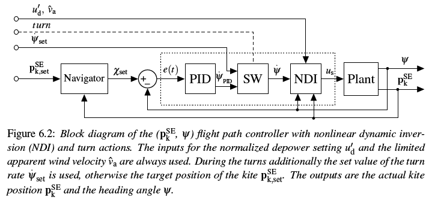
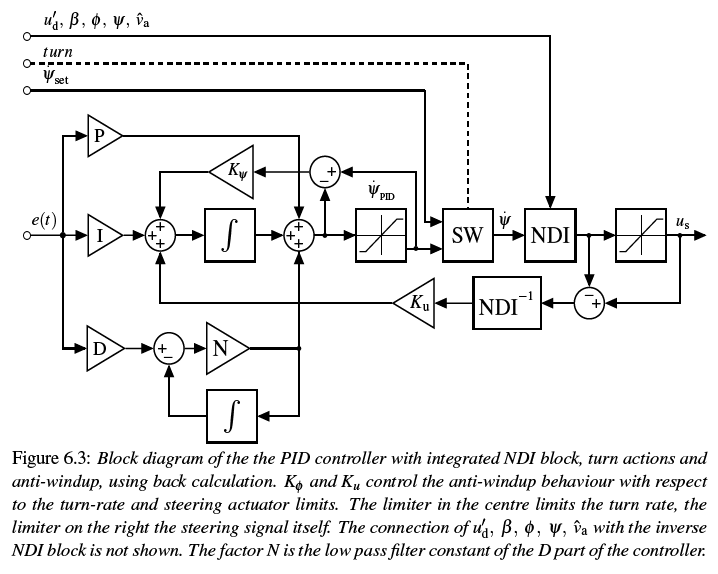
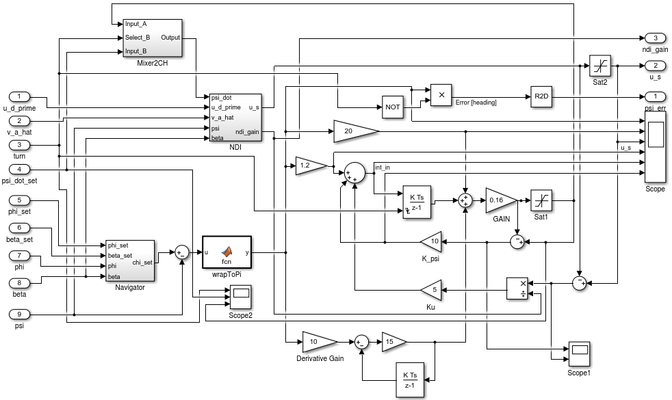

# KiteControllers
[](https://github.com/aenarete/KiteControllers.jl/actions/workflows/CI.yml?query=branch%3Amain)
[](https://codecov.io/gh/aenarete/KiteControllers.jl)

Discrete controllers for kite power systems.

## Utility functions
```
saturate(value, min_, max_)
```
Calculate a saturated value, that stays within the given limits.
```
wrap2pi(angle)
```
Convert an angle, given in radian in an infinite range to the range from -pi to pi

## Types
```julia
Integrator

int = Integrator()  
int = Integrator(2,3) # integration constant, inital output  
reset(int)  
update(int, 2)        # input value  
on_timer(int)
```
## Flight path controller
FlightPathController as specified in chapter six of the PhD thesis of Uwe Fechner.
```julia
FlightPathController
FPCSettings
function on_control_command(fpc, attractor=nothing, psi_dot_set=nothing, radius=nothing, intermediate = true)
function on_est_sysstate(fpc, phi, beta, psi, chi, omega, v_a; u_d=nothing, u_d_prime=nothing)
function calc_steering(fpc, parking)
```
<p align="center"></p>
<p align="center"></p>
<p align="center"></p>


## Winch controller
```
WinchController
```

## See also
- [Research Fechner](https://research.tudelft.nl/en/publications/?search=Uwe+Fechner&pageSize=50&ordering=rating&descending=true) for the scientic background of this code
- The application [KiteViewer](https://github.com/ufechner7/KiteViewer)
- the package [KiteUtils](https://github.com/ufechner7/KiteUtils.jl)
- the package [KitePodModels](https://github.com/aenarete/KitePodModels.jl)
- the package [KiteModels](https://github.com/ufechner7/KiteModels.jl)
- the package [KiteViewers](https://github.com/aenarete/KiteViewers.jl)
