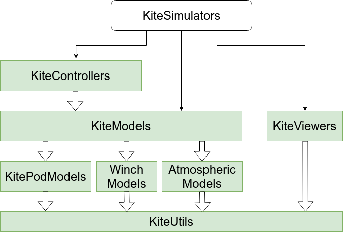

# KiteControllers
[](https://github.com/aenarete/KiteControllers.jl/actions/workflows/CI.yml?query=branch%3Amain)
[](https://codecov.io/gh/aenarete/KiteControllers.jl)

Discrete controllers for kite power systems.

This package is part of Julia Kite Power Tools, which consist of the following packages:
<p align="center"></p>

## Installation
```julia
using Pkg
pkg"add KiteControllers"
```

## This package provides
### Utility functions
```
saturate(value, min_, max_)
```
Calculate a saturated value, that stays within the given limits.
```
wrap2pi(angle)
```
Convert an angle, given in radian in an infinite range to the range from -pi to pi

### Types
```julia
Integrator
UnitDelay
FlightPathController
FPCSettings
WCSettings
```
Usage of the Integrator
```julia
int = Integrator()  
int = Integrator(2,3) # integration constant, inital output  
reset(int)            # reset the integrator
update(int, 2)        # input value  
on_timer(int)         # must be called on each timestep
```
Usage of UnitDelay
```julia
ud = UnitDelay()
for i in 1:3
    out = calc_output(ud, i)
    on_timer(ud)
    println(out)
end
```
Expected output: `0.0 1.0 2.0`
## Flight path controller
FlightPathController as specified in chapter six of the [PhD thesis](https://research.tudelft.nl/en/publications/a-methodology-for-the-design-of-kite-power-control-systems) of Uwe Fechner.
```julia
FlightPathController
FPCSettings
on_control_command(fpc, attractor=nothing, psi_dot_set=nothing, radius=nothing, intermediate = true)
on_est_sysstate(fpc, phi, beta, psi, chi, omega, v_a; u_d=nothing, u_d_prime=nothing)
on_timer(fpc)
calc_steering(fpc, parking)
```
The control commands are usually recived from the FlightPathPlanner, the output of the model or the system state estimator must call `on_est_systate()` each timestep.
<p align="center"></p>
<p align="center"></p>

## Scientific background
[Flight path control of kite power systems in a turbulent wind environment](https://ieeexplore.ieee.org/document/7525563)

## Winch controller
```
WinchController
```
For a kite power system, the reel-out speed of the winch must be controlled such that the
maximal tether force is never exceeded, while the reel out speed should be optimized for
maximal power over the full cycle at wind speeds below rated wind speed. To keep the
kite controllable, also a minimal tether force limit has to be kept. Depending on the mode of operation, one of the following three controllers is used:
### Speed Controller
<p align="center"></p>

### Lower Force Controller
<p align="center"></p>

### Upper Force Controller
<p align="center"></p>

## Scientific background
[A Methodology for the Design of Kite-Power Control Systems](https://research.tudelft.nl/en/publications/a-methodology-for-the-design-of-kite-power-control-systems) Chapter 6.3 Winch control (WC)

## Related
- [Research Fechner](https://research.tudelft.nl/en/publications/?search=wind+Fechner&pageSize=50&ordering=rating&descending=true) for the scientic background of this code
- The meta package [KiteSimulators](https://github.com/aenarete/KiteSimulators.jl) which contains all packages from Julia Kite Power Tools.
- the packages [KiteModels](https://github.com/ufechner7/KiteModels.jl) and [WinchModels](https://github.com/aenarete/WinchModels.jl) and [AtmosphericModels](https://github.com/aenarete/AtmosphericModels.jl)
- the packages [KiteViewers](https://github.com/aenarete/KiteViewers.jl) and [KiteUtils](https://github.com/ufechner7/KiteUtils.jl)
