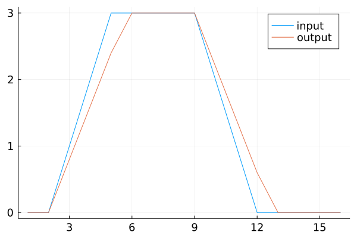
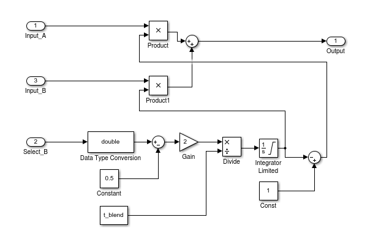
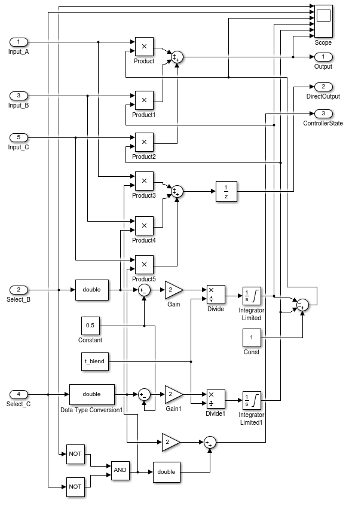
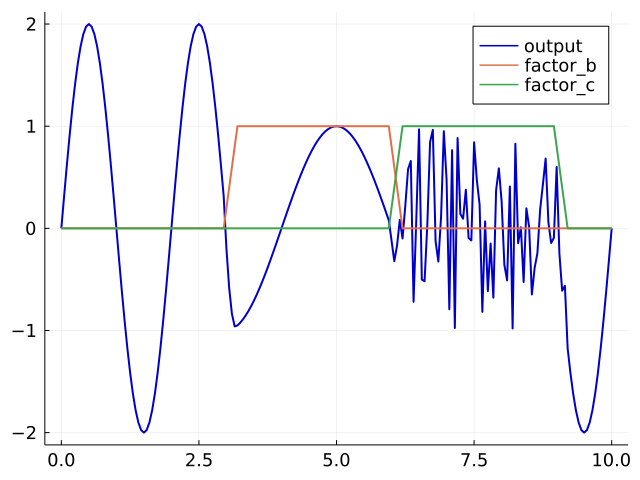

## Generic control components
A number of components (struct Types plus functions working on these types) of this package are generic and can be used for any type of controller.

They are documented on this page.

### Types
```julia
Integrator
UnitDelay
RateLimiter
Mixer_2D
Mixer_3D
```
#### Usage of the Integrator
```julia
int = Integrator()  
int = Integrator(0.05, 2, 3)  # dt, integration constant, inital output  
reset(int)                    # reset the integrator
input = 2
out = calc_output(int, input) # calculate the output 
on_timer(int)                 # must be called on each timestep
```
#### Usage of UnitDelay
```julia
ud = UnitDelay()
for i in 1:3
    out = calc_output(ud, i) # updates the input and calculates the output
    on_timer(ud)             # next timestep
    println(out)
end
```
Expected output: `0.0 1.0 2.0`

#### Usage of RateLimiter
```julia
using KiteControllers, ControlPlots
rl = RateLimiter(1.0, 0.8)
input =  [0,0,1,2,3,3,3,3,3,2,1,0,0,0,0,0]
out = zeros(16)
for i in 1:16
    out[i] = calc_output(rl, input[i])
    on_timer(rl)
end
plot(1:16, [input, out]; labels=["input", "output"])
```
Expected output:
<p align="center"></p>

### Mixer_2D
This component is equivalent to the following model:
<p align="center"></p>
It has two analog inputs, one digital input and one analog output. It selects either input a or input b depending on the value of the digital input and implements soft switching with a blend time t_blend.

```julia
m2 = Mixer_2CH(0.2, 1.0) # dt=0.2s, t_blend = 1.0s
x = ones(10)
y = 2*x
out = zeros(10)
for i in 1:length(x)
    in1=x[i]
    in2=y[i]
    out[i] = calc_output(m2, x[i], y[i])
    select_b(m2, i > 2)
    on_timer(m2)
end
@test all(out .≈ [1.0, 1.0, 1.0, 1.2, 1.4, 1.6, 1.8, 2.0, 2.0, 2.0])
```
### Mixer_3D
This component is equivalent to the following model:
<p align="center"></p>
It has three analog inputs, two digitals input and one analog output. It selects either input a or input b or input c depending on the values of the digital inputs and implements soft switching with a blend time t_blend.

Example:
```julia
for i in 1:SAMPLES
    if time(i) ≈ T1
        select_b(mix3, true)
    elseif time(i) ≈ T2
        select_c(mix3, true)
    elseif time(i) ≈ T3
        select_c(mix3, false)        
    end
    factor_b[i] = mix3.factor_b
    factor_c[i] = mix3.factor_c
    out[i] = calc_output(mix3, SIN1[i], SIN2[i], NOISE[i])
    on_timer(mix3)
end
```
You can find the full example under the name `test_mixer3.jl` in the test folder.
<p align="center"></p>

Continue with [README](../README.md)
