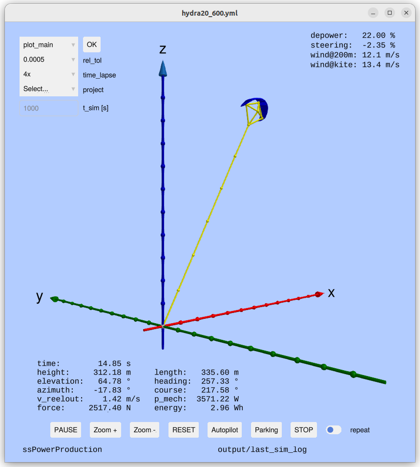

# Examples, if installed as Package

The example scripts can be copied to a local `examples/` folder with:

```julia
using KiteControllers
KiteControllers.copy_examples()
```

Or install everything (examples + required packages) in one step:

```julia
KiteControllers.install_examples()
```
# Examples, if installed using Git
Launch Julia with:
```
jl
```
Then you get the menu of the examples by typing:
```
menu()
```

## [autopilot.jl](https://github.com/aenarete/KiteControllers.jl/blob/main/examples/autopilot.jl) — Full Autopilot Simulation

The primary example demonstrating the complete control stack.

**Features:**
- Loads a kite model (`KPS4`) and kite control unit (`KCU`)
- Creates all settings (`WCSettings`, `FPCSettings`, `FPPSettings`)
- Builds a `SystemStateControl` and connects it to the kite model
- Runs a real-time simulation loop with a 3-D viewer

**Screenshot:**



You can select one of the four, pre-defined projects, run the simulation, and on the left you have menu options to 
print the statistics or show one of the many 2D plots, visualizing the results.

## [parking_4p.jl](https://github.com/aenarete/KiteControllers.jl/blob/main/examples/parking_4p.jl) — Parking Controller

Demonstrates how to bring a four-line kite to a stable parking position at
high elevation using `on_parking`.

```julia
using KiteControllers, KiteModels
# create ssc as above, then:
on_parking(ssc, tether_length=200.0)
```

## [minipilot.jl](https://github.com/aenarete/KiteControllers.jl/blob/main/examples/minipilot.jl) — Minimal Autopilot

A stripped-down autopilot without 2D plots for understanding how to build a GUI
based simulator. Exposes the core control loop in ~50 lines.

## [batch_pilot.jl](https://github.com/aenarete/KiteControllers.jl/blob/main/examples/batch_pilot.jl) — Batch Simulation

Runs multiple simulations back-to-back over a range of wind speeds and
records key statistics (mean power, reel-out speed, etc.) to an
[Apache Arrow](https://arrow.apache.org/) file in the `output/` folder.

**Run from the command line:**

```bash
bin/batch_pilot hydra20_426
```

Statistics are written to `output/batch-<project>_stats.yaml` and the full
time-series log to `output/batch-<project>.arrow`.

---

## [batch_plot](https://github.com/aenarete/KiteControllers.jl/blob/main/examples/batch_plot.jl) — Post-processing Viewer

Interactive command-line tool for visualizing the Arrow log files produced by
`batch_pilot`.  Backed by `examples/batch_plot.jl` and the launcher script
`bin/batch_plot`.

**Basic usage:**

```bash
# Open the interactive plot-selection menu for a project
bin/batch_plot hydra20_426

# Run a specific plot directly (window stays open until closed)
bin/batch_plot hydra20_426 plot_main
bin/batch_plot hydra20_426 plot_elev_az

# List all projects that have a log file in output/
bin/batch_plot --list

# List all available plot commands
bin/batch_plot --list-commands
```

**Available plot commands:**

| Command | Description |
|:--------|:------------|
| `statistics` | Print summary statistics to the terminal |
| `plot_main` | Height, elevation, azimuth, tether length, force, reel-out speed, cycle |
| `plot_power` | Force, reel-out speed, mechanical power, energy, acceleration |
| `plot_control` | Elevation, azimuth, heading, force, depower, steering, FPP state |
| `plot_control_II` | Azimuth, heading, steering, course, psi_dot, NDI gain |
| `plot_winch_control` | Elevation, azimuth, force, set-force, reel-out speed, winch state |
| `plot_aerodynamics` | Lift-to-drag ratio, angle of attack, steering, yaw rate, side-slip |
| `plot_elev_az` | Elevation vs. azimuth scatter |
| `plot_elev_az2` | Elevation vs. azimuth from cycle 2 onward |
| `plot_elev_az3` | Elevation vs. azimuth from cycle 3 onward |
| `plot_side_view` | Side view (height vs. x position) |
| `plot_side_view2` | Side view from cycle 2 onward |
| `plot_side_view3` | Side view from cycle 3 onward |
| `plot_front_view3` | Front view from cycle 3 onward |

## [tune_4p.jl](https://github.com/aenarete/KiteControllers.jl/blob/main/examples/tune_4p.jl) — Controller Tuning

Interactive script for tuning the flight path controller gains (`p`, `i`, `d`, `gain`)
for a four-line kite.  Changes gain values and immediately re-runs the simulation to
visualize the effect.

## [joystick.jl](https://github.com/aenarete/KiteControllers.jl/blob/main/examples/joystick.jl) — Manual Joystick Control

Allows manual steering via a gamepad or joystick while the winch is controlled
automatically or half-automatically by the `WinchController`.  Useful for learning how to steer a kite manually. Half-automatically means you provide a set point for the reel-out speed manually, but the `WinchController` ensures that the maximal and minimal force are respected.

## Learning Resources

| File | Purpose |
|:-----|:--------|
| [`autopilot.jl`](https://github.com/aenarete/KiteControllers.jl/blob/main/examples/autopilot.jl) | Full autopilot — start running this as first step |
| [`minipilot.jl`](https://github.com/aenarete/KiteControllers.jl/blob/main/examples/minipilot.jl) | Minimal autopilot without 2D plotting, good for understanding the code |
| [`parking_4p.jl`](https://github.com/aenarete/KiteControllers.jl/blob/main/examples/parking_4p.jl) | Parking of the 4 point kite with disturbance |
| [`batch_pilot.jl`](https://github.com/aenarete/KiteControllers.jl/blob/main/examples/batch_pilot.jl) | Batch simulations of projects |
| [`batch_plot`](https://github.com/aenarete/KiteControllers.jl/blob/main/examples/batch_plot.jl) | Post-processing and interactive plotting of batch logs |
| [`tune_4p.jl`](https://github.com/aenarete/KiteControllers.jl/blob/main/examples/tune_4p.jl) | Gain tuning of the parking controller |
| [`joystick.jl`](https://github.com/aenarete/KiteControllers.jl/blob/main/examples/joystick.jl) | Manual steering with automated or half-automated winch control |
| [`plots.jl`](https://github.com/aenarete/KiteControllers.jl/blob/main/examples/plots.jl) | Post-processing and plotting of Arrow log files, not to be executed on its own |
| [`stats.jl`](https://github.com/aenarete/KiteControllers.jl/blob/main/examples/stats.jl) | Statistical analysis of batch results, not to be executed on its own |

---

## Configuration Files

All settings are stored as YAML files in the `data/` folder.

| File | Settings struct |
|:-----|:----------------|
| [`settings.yaml`](https://github.com/aenarete/KiteControllers.jl/blob/main/data/settings.yaml) | General kite / simulation settings (`KiteUtils.Settings`) |
| [`system.yaml`](https://github.com/aenarete/KiteControllers.jl/blob/main/data/system.yaml) | System-level parameters |
| [`fpc_settings.yaml`](https://github.com/aenarete/KiteControllers.jl/blob/main/data/fpc_settings.yaml) | [`FPCSettings`](@ref) — flight path controller |
| [`fpp_settings.yaml`](https://github.com/aenarete/KiteControllers.jl/blob/main/data/fpp_settings.yaml) | [`FPPSettings`](@ref) — flight path planner |
| [`wc_settings.yaml`](https://github.com/aenarete/KiteControllers.jl/blob/main/data/wc_settings.yaml) | `WCSettings` — winch controller |

Copy the default configuration files with:

```julia
KiteControllers.copy_control_settings()
```
